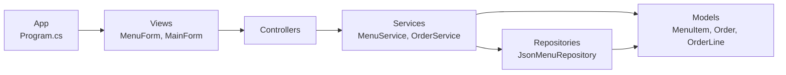
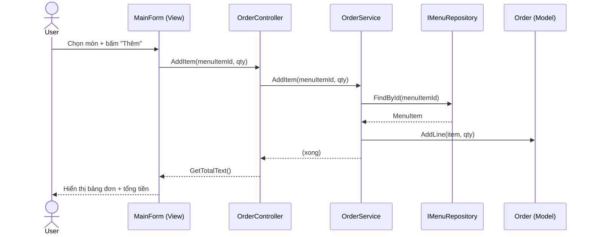

# SAD — Tổng quan kiến trúc RestaurantApp

## Tổng quan
RestaurantApp là ứng dụng **Windows Forms (.NET 8)** theo **kiến trúc phân tầng**
(layered architecture), tổ chức **monorepo**. Thay cho MVC cũ, nghiệp vụ và truy xuất dữ
liệu được tách rõ thành 3 tầng riêng: **Service**, **Repository**, **Model**.

## Các tầng & trách nhiệm
| Tầng | Project | Trách nhiệm |
|------|---------|-------------|
| **App** | `RestaurantApp.App` | Điểm vào, *composition root* — ráp mọi tầng. |
| **View** | `RestaurantApp.Views` | WinForms: hiển thị + nhận thao tác. Chỉ gọi Controller. |
| **Controller** | `RestaurantApp.Controllers` | Điều phối View ↔ Service. Không chứa logic. |
| **Service** | `RestaurantApp.Services` | Logic nghiệp vụ: validate, tìm kiếm, tính tiền. |
| **Repository** | `RestaurantApp.Repositories` | Truy xuất dữ liệu — lưu **JSON** (`data/*.json`). |
| **Model** | `RestaurantApp.Models` | Thực thể (entity) thuần. Tầng thấp nhất. |

## Đồ thị phụ thuộc (một chiều)

> **Quy tắc vàng**: mũi tên chỉ đi một chiều. Tầng dưới KHÔNG biết gì về tầng trên.
> Chi tiết ràng buộc: xem [layering-rules.md](layering-rules.md).

## Luồng "Thêm món vào đơn" (SCR-02)

## Vì sao tách Service / Repository / Model?
- **Model** không biết dữ liệu đến từ đâu → dễ test thuần logic.
- **Repository** đổi nguồn lưu trữ (JSON → DB) mà Service/Controller/View không đổi.
- **Service** gom logic một chỗ → tránh rải rác trong Form.
- Mỗi tầng là 1 project → **compiler ép buộc ranh giới** (xem `verifier`).
