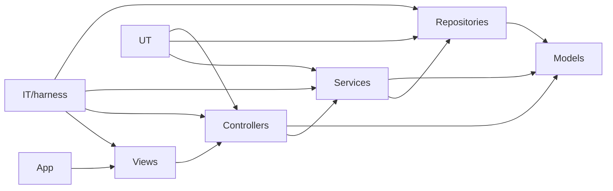

# SAD — Bố cục monorepo

## Cây thư mục mã nguồn
```
RestaurantApp/
├── RestaurantApp.sln
├── data/                  → dữ liệu JSON (seed mẫu, commit kèm)
│   └── menu.json
├── src/
│   ├── Models/        → RestaurantApp.Models.csproj        (net8.0) — entity thuần
│   ├── Repositories/  → RestaurantApp.Repositories.csproj  (net8.0) — lưu JSON
│   ├── Services/      → RestaurantApp.Services.csproj       (net8.0) — nghiệp vụ
│   ├── Controllers/   → RestaurantApp.Controllers.csproj    (net8.0) — điều phối
│   ├── Views/         → RestaurantApp.Views.csproj          (net8.0-windows, WinForms)
│   └── App/           → RestaurantApp.App.csproj            (WinExe, entry point)
└── tests/
    ├── UT/            → RestaurantApp.UnitTests.csproj (xUnit, mirror src/)
    │   ├── Models/
    │   ├── Repositories/
    │   ├── Services/
    │   └── Controllers/
    └── IT/            → integration test (testcases + evidence + harness + tool)
```

> **Quy ước**: tên **thư mục** rút gọn (`Models`, `Services`…); tên **project/assembly** và
> **namespace** vẫn đầy đủ (`RestaurantApp.Services`). Folder ngắn, project name dài.

## Đồ thị phụ thuộc (một chiều)

- `App` ráp mọi thứ (composition root): `JsonMenuRepository → MenuService → MenuController → MenuForm`.
- `Models` là tầng thấp nhất, KHÔNG tham chiếu tầng nào → ranh giới do compiler ép buộc.
- `UT` nhắm Services, Repositories, Controllers; `IT/harness` chạy cả View để chụp evidence.

## Ánh xạ tầng ↔ file chính
| Tầng | Thư mục | File tiêu biểu |
|------|---------|----------------|
| Model | `src/Models` | `MenuItem.cs`, `Order.cs`, `OrderLine.cs` |
| Repository | `src/Repositories` | `IMenuRepository.cs`, `JsonMenuRepository.cs`, `InMemoryMenuRepository.cs` |
| Service | `src/Services` | `MenuService.cs`, `OrderService.cs` |
| Controller | `src/Controllers` | `MenuController.cs`, `OrderController.cs` |
| View | `src/Views` | `MenuForm.cs`, `MainForm.cs` (+ `.Designer.cs`) |
| App | `src/App` | `Program.cs` |
| Unit test | `tests/UT/{Models,Repositories,Services,Controllers}` | `MenuServiceTests.cs`, `JsonMenuRepositoryTests.cs`… |
| Integration test | `tests/IT` | `testcases/`, `harness/Program.cs`, `tools/Run-IntegrationTests.ps1` |
