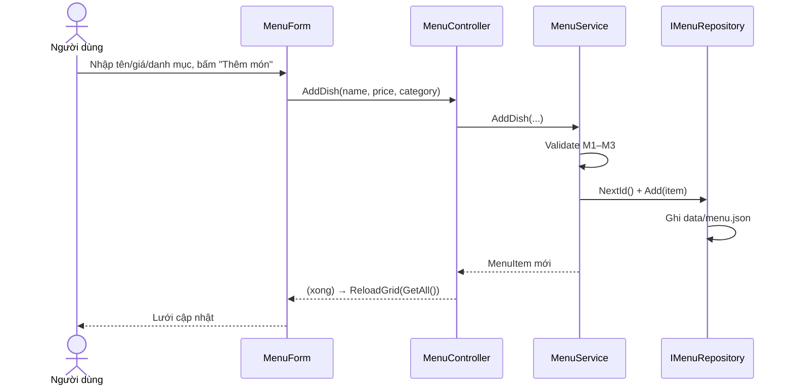

# [SCR-01] Quản lý & Tìm kiếm món — Detail Design

| Thuộc tính | Giá trị |
|------------|---------|
| Mã màn hình | SCR-01 |
| Basic design | [03-basic-designs/SCR-01-quan-ly-mon.md](../03-basic-designs/SCR-01-quan-ly-mon.md) |
| Form / Controller / Service | `MenuForm` / `MenuController` / `MenuService` |

## 1. Danh sách điều khiển (controls)
| Control | Kiểu | Tên (field) | Ý nghĩa |
|---------|------|-------------|---------|
| Ô tìm kiếm | TextBox | `txtSearch` | Từ khoá tìm theo tên/danh mục |
| Chỉ món đang bán | CheckBox | `chkOnlyAvailable` | Lọc bỏ món `IsAvailable = false` |
| Nút Tìm | Button | `btnSearch` | Áp dụng tìm kiếm |
| Nút Xoá lọc | Button | `btnClearSearch` | Trả về toàn bộ danh sách |
| Lưới món | DataGridView | `gridDishes` | 5 cột: Id, Tên, Danh mục, Đơn giá, Đang bán |
| Đếm | Label | `lblCount` | "N món" |
| Tên / Danh mục / Đơn giá | TextBox | `txtName` `txtCategory` `txtPrice` | Khu nhập liệu |
| Đang bán | CheckBox | `chkAvailable` | Trạng thái món khi thêm/sửa |
| Thêm / Cập nhật / Xoá | Button | `btnAdd` `btnUpdate` `btnDelete` | Thao tác CRUD |

## 2. Sự kiện & xử lý
| Sự kiện | Handler | Hành động | Gọi Controller |
|---------|---------|-----------|----------------|
| `btnSearch.Click` | `OnSearchClicked` | Lọc theo từ khoá + checkbox | `Search(keyword, onlyAvailable)` |
| `btnClearSearch.Click` | `OnClearSearchClicked` | Xoá ô tìm, nạp lại tất cả | `GetAll()` |
| `btnAdd.Click` | `OnAddClicked` | Thêm món từ khu nhập liệu | `AddDish(name, price, category)` |
| `btnUpdate.Click` | `OnUpdateClicked` | Sửa món theo Id đang chọn | `UpdateDish(id, ...)` |
| `btnDelete.Click` | `OnDeleteClicked` | Xoá món theo Id đang chọn | `DeleteDish(id)` |
| `gridDishes.SelectionChanged` | `OnGridSelectionChanged` | Đổ dòng đang chọn vào khu nhập liệu | — |

> Hook cho IT: `MenuForm.ApplySearch(keyword, onlyAvailable)` tái hiện thao tác tìm để chụp evidence.

## 3. Quy tắc nghiệp vụ (validate ở `MenuService`)
### Quản lý món (CRUD)
| Mã | Quy tắc |
|----|---------|
| M1 | Tên món **không được rỗng** (sau khi trim). |
| M2 | Tên món **không trùng** món khác (không phân biệt hoa thường). |
| M3 | Đơn giá **≥ 0** (dùng `decimal`). |
| M4 | Sửa/xoá theo **Id**; Id không tồn tại → `InvalidOperationException`. |
| M5 | Khi sửa, kiểm tra trùng tên **loại trừ chính món đang sửa**. |

### Tìm kiếm món (`MenuService.Search`)
| Mã | Quy tắc |
|----|---------|
| S1 | Khớp khi **tên HOẶC danh mục** chứa từ khoá. |
| S2 | **Không phân biệt hoa thường** (so khớp lowercase). |
| S3 | Từ khoá **rỗng/trắng** → trả **toàn bộ** danh sách. |
| S4 | `onlyAvailable = true` → loại món `IsAvailable = false`. |
| S5 | Cắt khoảng trắng đầu/cuối từ khoá trước khi so. |

## 4. API liên quan
- `MenuController.GetAll()` → `MenuService.GetAll()` → `IMenuRepository.GetAll()`
- `MenuController.AddDish(name, price, category)` → `MenuService.AddDish(...)` → `repo.Add` + `repo.NextId`
- `MenuController.UpdateDish(id, name, price, category, isAvailable)` → `MenuService.UpdateDish(...)` → `item.Update` + `repo.Update`
- `MenuController.DeleteDish(id)` → `MenuService.DeleteDish(id)` → `repo.Remove`
- `MenuController.Search(keyword, onlyAvailable = false)` → `MenuService.Search(...)`

## 5. Luồng tuần tự — Thêm món

## 6. Xử lý lỗi
- Mọi `Exception` từ Controller → `MessageBox` cảnh báo (`ShowError`), lưới giữ nguyên.
- Đơn giá nhập sai định dạng → `FormatException("Đơn giá phải là số")`.

## 7. Test bao phủ
- UT: `tests/UT/Services/MenuServiceTests.cs` (M1–M5, S1–S5), `tests/UT/Controllers/MenuControllerTests.cs`.
- IT: TC-001 (thêm), TC-002 (chặn trùng), TC-003 (tìm), TC-004 (xoá).
