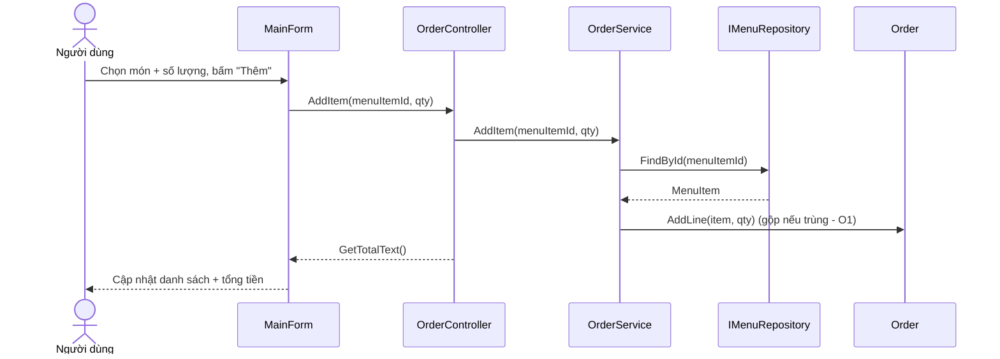

# [SCR-02] Gọi món / Lập đơn — Detail Design

| Thuộc tính | Giá trị |
|------------|---------|
| Mã màn hình | SCR-02 |
| Basic design | [03-basic-designs/SCR-02-goi-mon.md](../03-basic-designs/SCR-02-goi-mon.md) |
| Form / Controller / Service | `MainForm` / `OrderController` / `OrderService` |

## 1. Danh sách điều khiển (controls)
| Control | Kiểu | Tên (field) | Ý nghĩa |
|---------|------|-------------|---------|
| Chọn món | ComboBox | `cboMenu` | Thực đơn; `DisplayMember=Name`, `ValueMember=Id` |
| Số lượng | NumericUpDown | `numQuantity` | Số lượng món (≥ 1) |
| Thêm | Button | `btnAdd` | Thêm món đã chọn vào đơn |
| Danh sách đơn | ListBox | `lstOrder` | Mỗi dòng: "Tên xSL = thành tiền" |
| Tổng | Label | `lblTotal` | "Tổng: N đ" |

## 2. Sự kiện & xử lý
| Sự kiện | Handler | Hành động | Gọi Controller |
|---------|---------|-----------|----------------|
| `btnAdd.Click` | `OnAddClicked` | Lấy `cboMenu.SelectedValue` + `numQuantity` → thêm vào đơn | `AddItem(menuItemId, qty)` |
| *(sau khi thêm)* | `RefreshOrder` | Đổ lại các dòng đơn + cập nhật tổng | `GetLines()`, `GetTotalText()` |

## 3. Quy tắc nghiệp vụ (tính tiền — `Order` + `OrderService`)
| Mã | Quy tắc |
|----|---------|
| R1 | `Subtotal = Σ (đơn giá × số lượng)` mọi dòng. |
| R2 | `VAT = (Subtotal − Discount) × 10%` (VAT tính **sau** giảm giá). |
| R3 | `Subtotal ≥ 500.000đ` → giảm 10% trên Subtotal. |
| R4 | `Total = (Subtotal − Discount) + VAT`, không bao giờ âm. |
| R5 | Mọi phép tính dùng `decimal`; hiển thị làm tròn tới đồng. |
| O1 | Thêm món đã có trong đơn → **gộp số lượng** (không tạo dòng mới). |
| O2 | Số lượng **≤ 0** → `ArgumentOutOfRangeException`. |
| O3 | `menuItemId` không tồn tại → `InvalidOperationException`. |

## 4. API liên quan
- `OrderController.GetMenu()` → `OrderService.GetMenu()` → `IMenuRepository.GetAll()`
- `OrderController.AddItem(menuItemId, quantity)` → `OrderService.AddItem(...)` → `repo.FindById` + `Order.AddLine`
- `OrderController.GetLines()` → `OrderService.GetLines()` → `Order.Lines`
- `OrderController.GetTotalText()` → định dạng `OrderService.GetTotal()` thành "N đ"

## 5. Luồng tuần tự — Thêm món vào đơn

## 6. Xử lý lỗi
- `AddItem` với Id không tồn tại / SL ≤ 0 → ngoại lệ → `MessageBox` cảnh báo, đơn giữ nguyên.

## 7. Test bao phủ
- UT: `tests/UT/Services/OrderServiceTests.cs` (R1–R5, O1–O3),
  `tests/UT/Controllers/OrderControllerTests.cs` (định dạng tổng tiền),
  `tests/UT/Models/OrderTests.cs` (công thức tính trên entity).
