<!--
  TEMPLATE — Detail Design (Thiết kế chi tiết) cho MỘT màn hình.
  Copy file này, đổi tên thành SCR-NN-<slug>.md, điền các mục dưới.
  Detail design = "nhìn từ trong ra": từng control, sự kiện, validate, API, luồng tuần tự.
  Phải khớp với Basic Design cùng mã (03-basic-designs/SCR-NN-<slug>.md).
-->
# [SCR-NN] <Tên màn hình> — Detail Design

| Thuộc tính | Giá trị |
|------------|---------|
| Mã màn hình | SCR-NN |
| Basic design | [03-basic-designs/SCR-NN-<slug>.md](../03-basic-designs/) |
| Form / Controller / Service | `<Form>` / `<Controller>` / `<Service>` |

## 1. Danh sách điều khiển (controls)
| Control | Kiểu | Tên (field) | Ý nghĩa |
|---------|------|-------------|---------|
| <...> | TextBox/Button/... | `txt...` | <...> |

## 2. Sự kiện & xử lý
| Sự kiện | Handler | Hành động | Gọi Controller |
|---------|---------|-----------|----------------|
| <Click ...> | `On...Clicked` | <...> | `controller.X(...)` |

## 3. Quy tắc nghiệp vụ (validate ở Service)
| Mã | Quy tắc |
|----|---------|
| X1 | <...> |

## 4. API liên quan
- `Controller.Method(...)` → `Service.Method(...)`

## 5. Luồng tuần tự

```mermaid
sequenceDiagram
    actor U
    participant V as <Form>
    participant C as <Controller>
    participant S as <Service>
    U->>V: <thao tác>
    V->>C: <gọi>
    C->>S: <gọi>
    S-->>V: <kết quả>
```

## 6. Xử lý lỗi
- <Ngoại lệ nào → hiển thị thế nào>.

## 7. Test bao phủ
- UT: <...>
- IT: <...>
