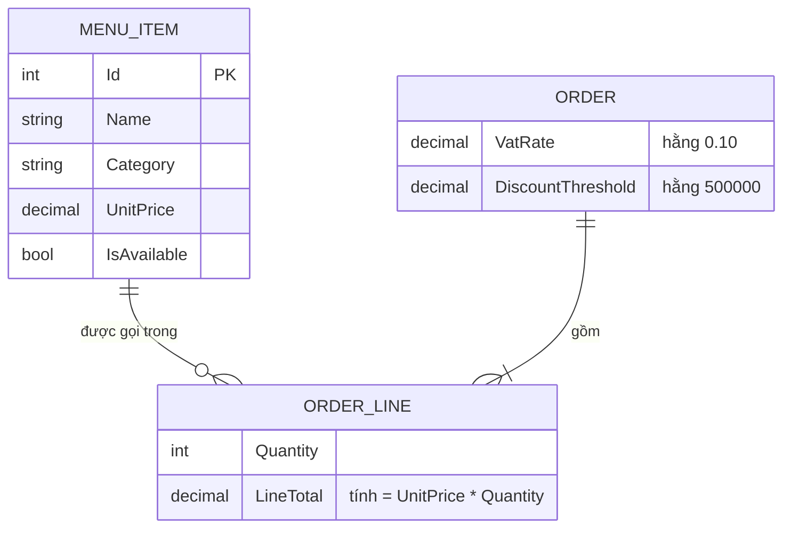

# Data — Sơ đồ quan hệ thực thể (ER)

## Sơ đồ ER

## Diễn giải quan hệ
- **MenuItem 1 — n OrderLine**: một món có thể xuất hiện ở nhiều dòng (của nhiều đơn).
  Trong một đơn, cùng một món chỉ có **1 dòng** (quy tắc gộp O1).
- **Order 1 — n OrderLine**: một đơn gồm nhiều dòng món (ít nhất 1 khi đã thêm).
- `OrderLine` **tham chiếu** `MenuItem` (giữ object), không copy giá → giá luôn nhất quán.

## Lưu ý mô hình hoá
- Chỉ `MenuItem` là **dữ liệu chủ** (master, lưu JSON). `Order`/`OrderLine` là **dữ liệu
  giao dịch phiên** — chưa lưu trữ trong phạm vi hiện tại (xem [json-storage.md](json-storage.md)).
