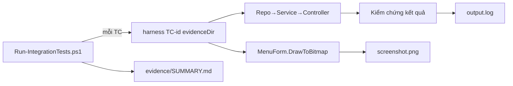

# Integration Test (IT)

Kiểm thử tích hợp chạy **luồng thật** qua đủ các tầng và tự **chụp evidence** cho từng testcase.

## Thành phần
| Thư mục | Vai trò |
|---------|---------|
| `testcases/` | Đặc tả từng testcase (`TC-00x-*.md`) + `testcases.json` (manifest tool đọc) |
| `harness/` | Console app (.NET WinForms) chạy 1 testcase: dựng Repo→Service→Controller→View, kiểm chứng, chụp `MenuForm`, ghi evidence |
| `evidence/` | Kết quả tự sinh: `evidence/<TC>/output.log` + `screenshot.png`, và `SUMMARY.md` |
| `tools/Run-IntegrationTests.ps1` | Tool orchestrator: lặp manifest, gọi harness từng testcase, gom SUMMARY |

## Luồng hoạt động


## Chạy
```bash
powershell -File tools/Run-IntegrationTests.ps1            # tất cả testcase (pwsh 7 cũng được)
powershell -File tools/Run-IntegrationTests.ps1 -TestCase TC-003
powershell -File tools/Run-IntegrationTests.ps1 -EvidenceDir <dir>   # đổi nơi lưu evidence
```
Yêu cầu **.NET 8 SDK**. Harness chụp UI bằng `Control.DrawToBitmap` (không cần màn hình thật,
cửa sổ dựng ngoài vùng nhìn) nên chạy được cả khi không tương tác.

## Thêm testcase mới
1. Viết `testcases/TC-00x-*.md` (đặc tả).
2. Thêm dòng vào `testcases/testcases.json`.
3. Thêm scenario tương ứng trong `harness/Program.cs` (map theo `TC-id`).
